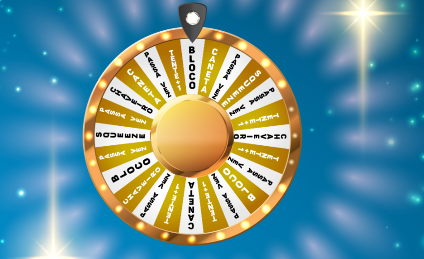

# ROLETA DA SORTE
👨‍🏫ESTE PROJETO É UMA ROLETA INTERATIVA QUE GIRA E SELECIONA UM ITEM ALEATORIAMENTE QUANDO O USUÁRIO CLICA.

  

## DESCRIÇÃO:
Este projeto é uma "roleta da sorte" interativa que gira e seleciona um item aleatoriamente quando o usuário clica ou pressiona uma tecla (Enter ou espaço). A roleta é representada graficamente no navegador, e ao ser acionada, toca um som e gira por 23 segundos, simulando um sorteio.

## NÃO SABE?
- Entendemos que para manipular arquivos em `HTML`, `CSS` e outras linguagens relacionadas, é necessário possuir conhecimento nessas áreas. Para auxiliar nesse aprendizado, oferecemos cursos gratuitos disponíveis:
* [CURSO DE HTML E CSS](https://github.com/VILHALVA/CURSO-DE-HTML-E-CSS)
* [CURSO DE JAVASCRIPT](https://github.com/VILHALVA/CURSO-DE-JAVASCRIPT)
* [CURSO DE JQUERY](https://github.com/VILHALVA/CURSO-DE-JQUERY)
* [CONFIRA MAIS CURSOS](https://github.com/VILHALVA?tab=repositories&q=+topic:CURSO)

## CREDITOS:
- [PROJETO CRIADO PELO "PauloFelipeM"](https://github.com/PauloFelipeM/sorteio-valores-formato-rollete)
- [PROJETO EDITADO PELO VILHALVA](https://github.com/VILHALVA)

